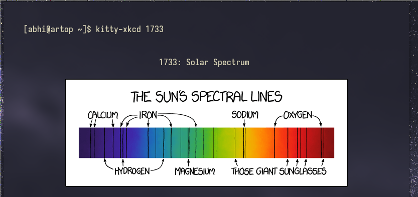

# kitty-xkcd
view xkcd comics in kitty

# requirements:
- kitty
- curl (to download images)
- BSD/Linux (guh bindows) 

# features:
- [x] caches images
- [x] fast
- [x] uses kitty's icat to preview images
- [x] no 3rd party dependencies needed
- [x] very easy

# installation:

```
$ git clone https://github.com/abrik1/kitty-xkcd
$ sudo install -Dm755 kitty-xkcd/main.py /usr/bin/kitty-xkcd
$ kitty-xkcd 234 # testing purposes only
``` 

# preview:

https://1drv.ms/p/s!ApPm0aVveqJEg0ysDbnl4dlOhyu8?e=VyJQqg # echo
